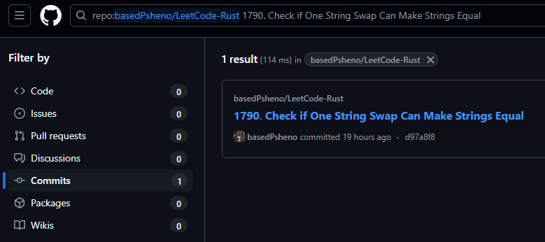

# Leetcode Solutions in Rust
Этот репозиторий содержит мои решения задач с [Leetcode](https://leetcode.com/), написанные на [Rust](https://www.rust-lang.org/). Каждое решение находится в отдельном коммите, что позволяет легко отслеживать изменения и прогресс.

## Мой профиль на Leetcode
Вы можете найти мой профиль на Leetcode здесь: [BasedPsheno](https://leetcode.com/u/basedPsheno/).

## Поиск по коммитам
Чтобы найти нужную задачу, введите в поисковую строку следующее выражение `repo:basedPsheno/LeetCode-Rust [Полное название задачи, скопированное с Leetcode]`, и затем перейдите в **Commits**.

